# 🚗 FLOTA — Control de Flotilla

> Aplicación Android nativa (APK) y web progresiva para la gestión integral de flotas vehiculares — bitácoras semanales, historial de mantenimiento, reportes financieros con IA, alertas inteligentes por kilometraje y notificaciones push diarias.

      

---

## 📋 Descripción

**FLOTA — Control de Flotilla** es una solución full-stack para propietarios y operadores de flotas de vehículos de plataformas digitales (Uber, DiDi, Cabify), renta y logística. Permite registrar bitácoras semanales, controlar costos de mantenimiento, gestionar siniestros y visualizar rentabilidad por unidad — todo sincronizado en la nube con soporte offline.

La app se despliega como **APK nativo para Android** usando Capacitor, con backend en Express + Google Cloud Run, base de datos en Supabase y autenticación por Row Level Security (RLS).

---

## 📸 Screenshots

### Pantalla de Login
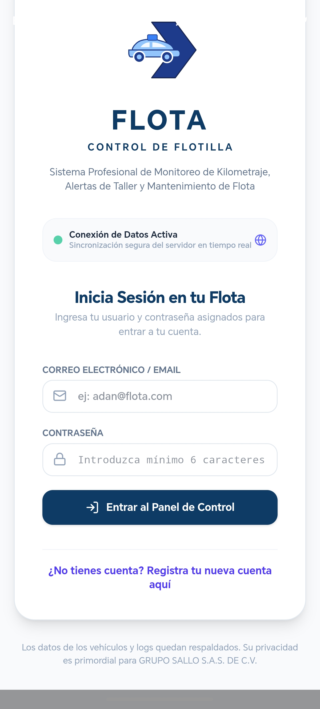

| Dashboard Principal | Detalle de Unidad |
|---|---|
| 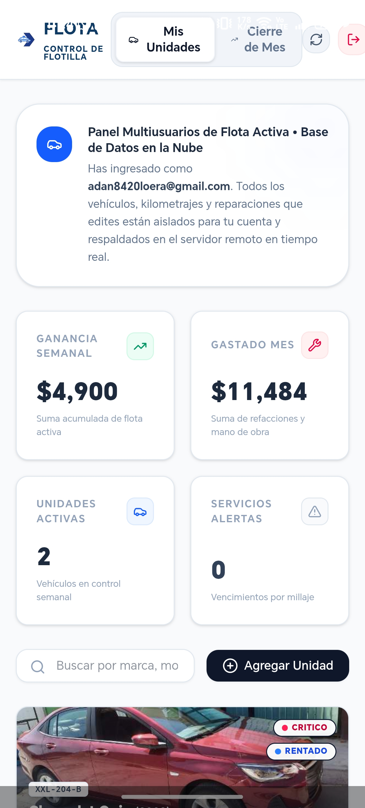 | 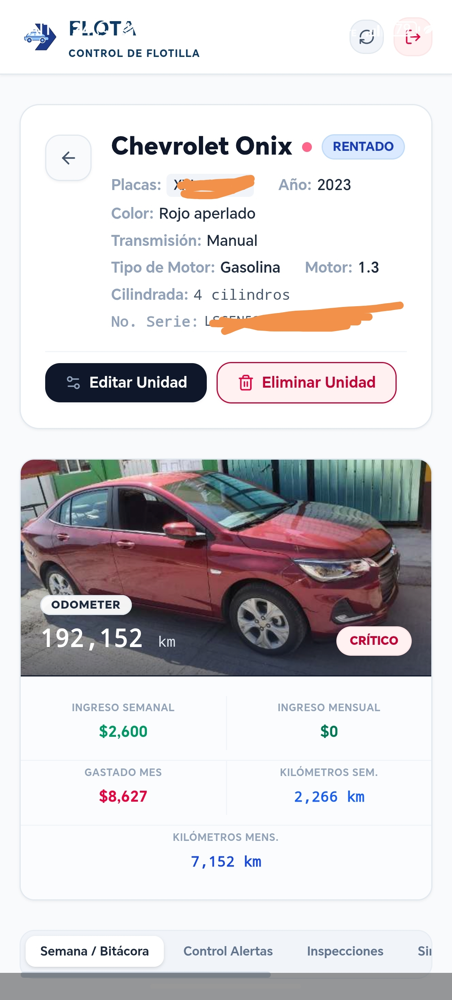 |

| Bitácora Semanal | Archivo de Inspecciones |
|---|---|
| 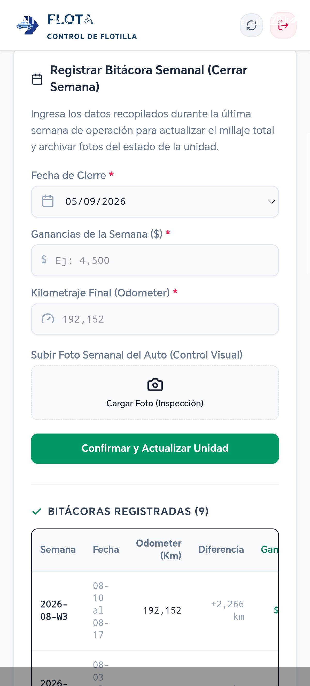 | 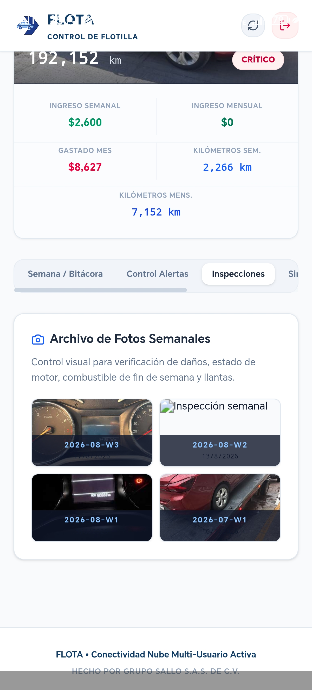 |

| Historial de Mantenimiento | Mantenimientos Pendientes |
|---|---|
| 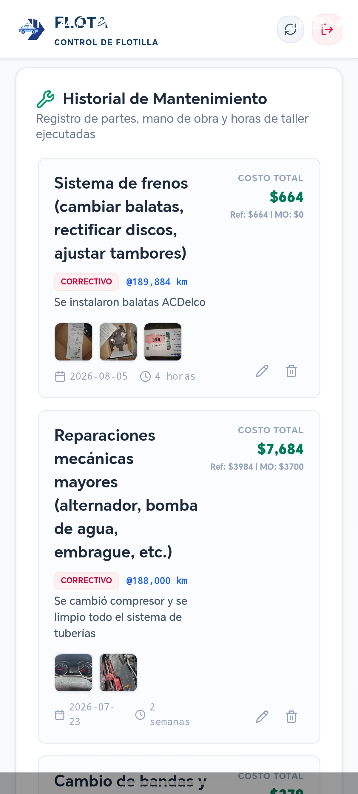 | 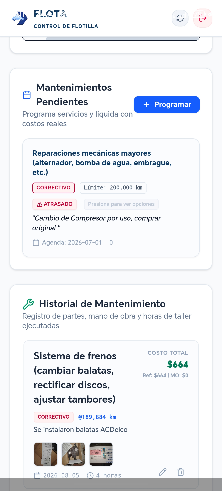 |

| Control de Alertas por Km | Siniestros |
|---|---|
| 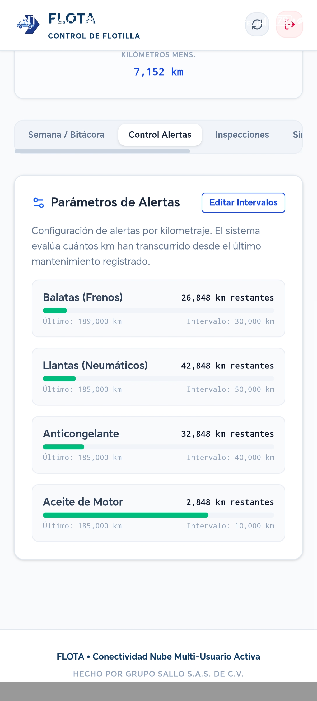 | 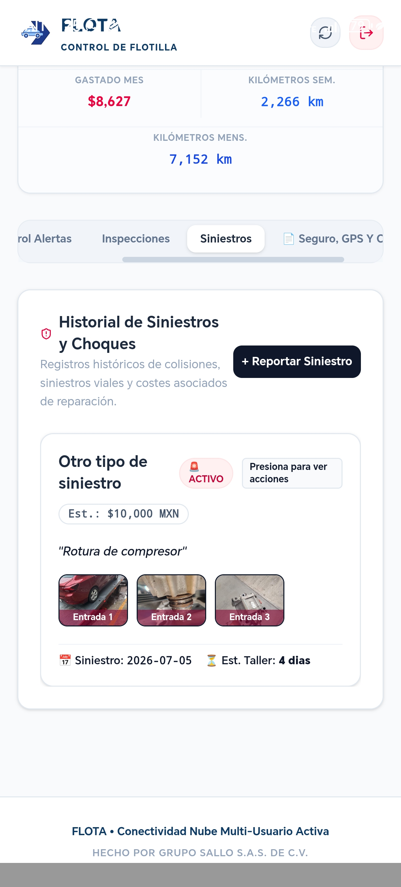 |

| Seguro, GPS y Contratos | Reporte IA Financiero |
|---|---|
| 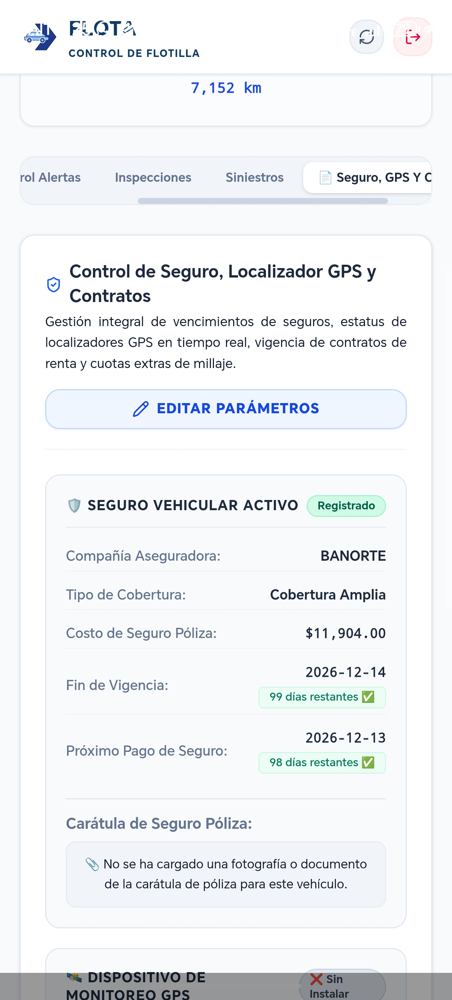 | 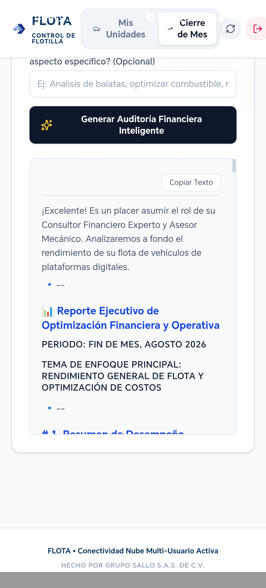 |

| Cierre de Mes — Gráfica | Cierre de Mes — Desglose |
|---|---|
| 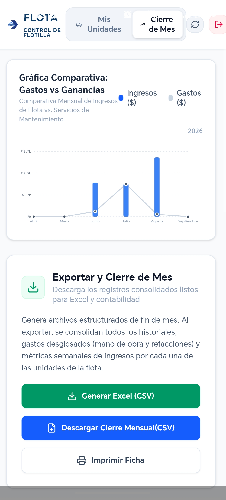 | 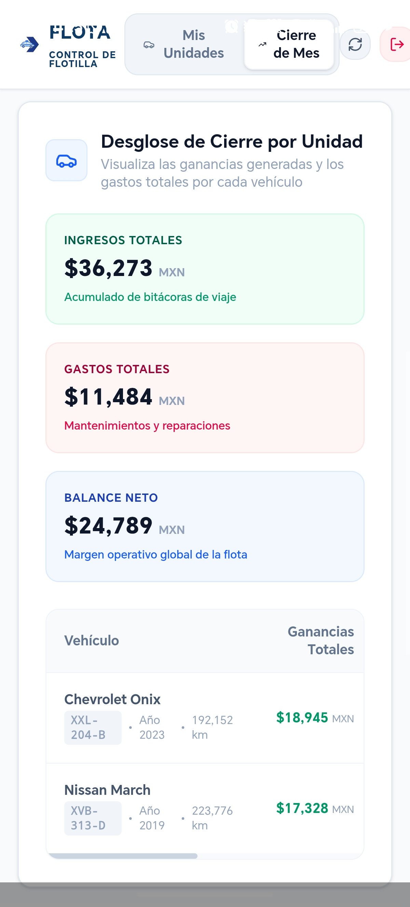 |

---

## ✨ Funcionalidades principales

### 🏠 Dashboard
- Vista de estado de toda la flota con semáforo de salud por vehículo (Excelente / Atención / Crítico)
- Ganancia semanal acumulada de últimos 7 días de todas las unidades
- Gasto del mes y unidades activas en tiempo real
- Acceso rápido a agregar nuevas unidades

### 📋 Bitácora Semanal
- Registro de kilometraje, ganancias y fotos de inspección visual por semana
- Historial completo de bitácoras con diferencial de km y ganancias
- Archivo fotográfico organizado por semana para control visual de estado del vehículo

### 🔧 Historial de Mantenimiento
- Preventivo, predictivo, correctivo y estético con costos de refacciones y mano de obra
- Galería de fotos de evidencia por cada servicio
- Fecha, duración en taller y observaciones técnicas

### 📅 Mantenimientos Pendientes
- Programación por fecha o kilometraje
- Alertas automáticas cuando el km supera el límite o la fecha venció
- Completar pendientes con costos reales y vincularlos automáticamente a siniestros relacionados

### 🚨 Gestión de Siniestros
- Registro de incidentes con fotos antes/después
- Costos estimados vs reales con fechas de cierre
- **Vínculo inteligente a mantenimiento**: al vincular un siniestro a un mantenimiento ya registrado, el costo se excluye del doble conteo en los reportes financieros
- Indicadores visuales `🔗 Sin doble conteo` y `⏳ Vinculado a pendiente`

### 📊 Control de Alertas por Kilometraje
- Intervalos personalizados para balatas, llantas, aceite y anticongelante
- Barra de progreso visual con km restantes
- Alertas al 90% del intervalo y al vencimiento

### 🛡️ Seguro, GPS y Contratos
- Control de vigencia de póliza de seguro con días restantes
- Próximo pago de seguro con recordatorio
- Estado del localizador GPS (activo / sin instalar)
- Fecha de contrato de renta con alertas de vencimiento
- Carga de caratula de póliza en foto

### 🤖 Reporte Financiero con IA (Gemini)
- Auditoría inteligente de costos y predicción mecánica
- Análisis enfocado en el tema que especifique el usuario (balatas, combustible, etc.)
- Generado por Google Gemini 2.5 Flash desde el servidor

### 📈 Cierre de Mes
- Gráfica comparativa Ingresos vs Gastos de los últimos meses
- Etiquetas por nombre de mes (Enero, Febrero…) con año en esquina superior
- Desglose por unidad: ingresos totales, gastos y balance neto
- Exportar a CSV para Excel y contabilidad
- Imprimir ficha de la unidad

### 🔔 Notificaciones Push Diarias (FCM)
- Notificaciones nativas Android aunque la app esté **cerrada**
- Google Cloud Scheduler llama al servidor cada día a las 9 AM
- Evalúa 10 tipos de alertas: balatas, llantas, aceite, anticongelante, seguro, GPS, verificación, tenencia, contrato y mantenimientos pendientes
- Si todo está en orden: `✅ Flota en Buen Estado — X unidades sin alertas`
- Tokens FCM persistidos en Supabase para sobrevivir reinicios del servidor

---

## 🛠️ Stack tecnológico

| Capa | Tecnología |
|---|---|
| Frontend | React 19, TypeScript 5.8, Tailwind CSS 4 |
| Backend / BaaS | Supabase (PostgreSQL, Auth, RLS) |
| Mobile | Capacitor 8 (Android APK) |
| Server | Express + Node.js en Google Cloud Run |
| AI | Google Gemini 2.5 Flash (`@google/genai`) |
| Push Notifications | Firebase Cloud Messaging (FCM) |
| Scheduler | Google Cloud Scheduler → `/api/notify/daily-push` |
| Build | Vite 6 |
| Animaciones | Motion (Framer Motion) |
| Iconos | Lucide React |

---

## 🔐 Seguridad

- Las credenciales de Supabase y Gemini API Key se manejan en el servidor (Cloud Run), no expuestas en el bundle del cliente
- `FIREBASE_SERVICE_ACCOUNT_JSON` como secret en Cloud Run para autenticar FCM
- Todas las tablas usan RLS: un usuario autenticado solo puede leer/escribir sus propios registros
- `google-services.json` vinculado al package `com.sallo.flota`

---

## 🗺️ Roadmap

- [x] Notificaciones push nativas Android (FCM + Cloud Scheduler)
- [x] Reporte financiero con IA (Gemini 2.5 Flash)
- [x] Vinculación siniestro ↔ mantenimiento (sin doble conteo)
- [x] Multi-foto en bitácoras, mantenimientos y siniestros
- [x] Cierre de mes con gráfica comparativa mensual
- [x] Exportar a CSV para Excel y contabilidad
- [ ] Notificaciones push en iOS (Capacitor)
- [x] Modo multi-usuario / compartir flota con empleados
- [ ] Integración con Google Maps para rutas
- [ ] Reportes en PDF descargables

---

## 👤 Autor

**Adán Loera Sánchez** — Full Stack Developer · Estado de México

 

---

## 📄 Licencia

Copyright (c) 2026 Adán Loera Sánchez and Grupo Sallo S.A.S. de C.V. All rights reserved.
This code is not open source. Viewing is permitted for portfolio purposes only.
Copying, modifying, or distributing this code is strictly prohibited.
